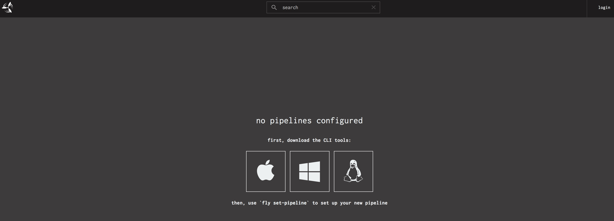
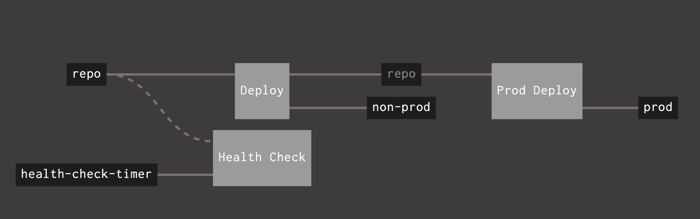

##Concourse How-To
### Overview	
Concourse.ci is CI/CD DevOps pipeline tool that can be used with any source code repo. 
Concourse is based on docker containers. When you install concourse there will be two containers running.
One is the concourse and other one is the postgres database. 

### Install Concourse locally on macOS

In this section we will install Concourse on macOS
Download concourse and fly from this location [https://concourse-ci.org/download.html]

Once you install concourse run following commands:

##### Start concourse server: 
```
docker-compose up -d
```



##### Stop concourse server: 
```
docker-compose down
```
### fly cli
###
     Installing fly
###

Install fly - click the apple logo
(note you may need to just open the fly.dms app in Downloads and “bypass anyway”

Install fly - click the apple logo 

run fly install from command line
```
 $ cd ~/Downloads/
 $ mv fly.dms fly
 $ install fly /usr/local/bin
 $ which fly 
    // should be /usr/local/bin/fly)
  $ fly -version  
    // should be 4.0.0. or later
```

##### Using fly to login to concourse
```yaml
$ fly login -t hello -u test -p test -c http://127.0.0.1:8080

```
##### Using fly to set target
 
 ```yaml

$ fly -t tutorial login -c http://127.0.0.1:8080 http://127.0.0.1:8080/sky/login?redirect_uri=http://127.0.0.1:58205/auth/callback

logging in to team 'main'


target saved

```
##### Using fly to create pipeline

In this case it is assumed that pipeline.yml file is already created. We will discuss more about
pipeline creation in next section.
```yaml
$ fly -t tutorial set-pipeline -p test -c pipeline.yml
```
##### Using fly to un-pause pipeline
```yaml
$ fly -t tutuorial unpause-pipeline -p test
```
##### Using fly to destroy pipeline
```yaml
$ fly -t tutorial destroy-pipeline -p test
```
#####Using fly to get status for targets
```yaml
fly -t tutorial status 

```
#####Using fly to logout
```yaml
fly -t tutorial logout
```
     
###
#### Creating concourse folder structure
###

##### Create concourse related files

```text
Repo-folder
$ ci
  |- pipeline.yml
  |- build.sh
  |- build.yml
```

##### Updating pipeline.yml to create pipeline for the project
```yaml
resources:
- name: repo
  type: git
  source:
   uri: giturl
   branch: concourse-deploy
- name: non-prod
  type: cf
  source:
    api: https://api.ng.bluemix.net
    username: apikey
    password: privatekey
    organization: org
    space: dev
    skip_cert_check: false
- name: prod
  type: cf
  source:
    api: https://api.ng.bluemix.net
    username: apikey
    password: privatekey
    organization: org
    space: prod
    skip_cert_check: false
- name: health-check-timer
  type: time
  source: {interval: 5m}

jobs:
- name: Deploy
  serial: true
  public: true
  plan:
  - get: repo
    trigger: true
  - task: build-code
    file: repo/devops/build.yml

  - put: non-prod
    params:
     manifest: build/manifest.yml

- name: Prod Deploy
  serial: true
  public: true
  plan:
  - get: repo
    trigger: true
    passed: [Deploy]
  - task: build-code
    file: repo/devops/build.yml

  - put: prod
    params:
     manifest: build/manifest.yml

- name: Health Check
  serial: false
  build_logs_to_retain: 5
  plan:
  - get: health-check-timer
    trigger: true
  - get: repo
  - task: healthcheck
    file: repo/healthcheck.yml
```

####build.yml
```yaml
platform: linux

image_resource:
  type: docker-image
  source: {repository: java, tag: openjdk-8}

inputs:
- name: ConcourseDemo

run:
  path: ConcourseDemo/ci/build.sh
```

####build.sh
```bash
export TERM=${TERM:-dumb}
cd repo
./gradlew clean build
cd ../..
mkdir -p build
cp repo/manifest.yml ./build
cp repo/build/libs/concoursedemo-0.0.1.war ./build
ls -ltr
```
##### Pipeline on Concourse 
Once pipeline is setup you can see it on concourse console as:


 ##### Adding Resources and Jobs to pipeline.yml
 
 ######Adding following resources
 
     - get  : to make a pull from bitbucket/github repo
     - task : to execute gradle build on the repo
     - put   : to push the app to PaaS using Cloud Foundry
     
     All tasks are separate docker containers and if you need to move around genreated output from get to put
     You need to copy source to destination as shown in build.sh file
#### Concourse best practices

It is recommended to create separate concourse folder structure for each repo.

Each repo can run as a separate pipeline with setting same target for all repo under one organization

#### Reference Links	
#####Concourse download
https://concourse-ci.org/download.html

#####Tutorial
https://concourse-ci.org/getting-started.html

#####fly doc
https://concourse-ci.org/fly.html
https://github.com/harshild/cf-concourse-example

#####Docker deploy how-to
https://console.bluemix.net/docs/containers/cs_tutorials_apps.html#cs_apps_tutorial
